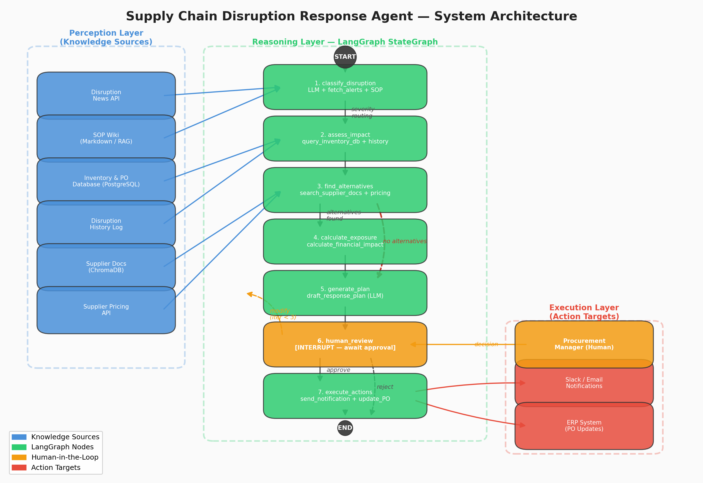

# ChainPilot

> **Agentic supply-chain disruption analyst.** A port closes, a supplier misses a lead time —
> ChainPilot researches the blast radius across inventory, supplier, and incident-history sources,
> then proposes a costed response plan. Two specialised agents, isolated tool permissions, and
> guardrails that assume the input is hostile.

<p>
  
  
  
  
  
  
</p>

---

## The problem

Supply-chain disruption response is a research task before it is a decision task. When a shipment
stalls, somebody has to check current inventory, find qualified alternate suppliers, pull how a
similar incident was handled last time, price the substitution, and only *then* recommend an
action. That work is spread across documents, databases, and alert feeds — and it is usually done
under time pressure by whoever is free.

A single LLM with every tool bolted on does this badly. It reaches for conclusions before it has
gathered facts, and it will happily fire a purchase-order update on the strength of a half-read
document.

---

## The approach: separate research from judgment

ChainPilot splits the work across two agents with **non-overlapping tool registries**:

```
        ┌──────────────────────────────────────────────────────────────┐
        │                      RESEARCHER AGENT                        │
        │  "Surface facts. Never recommend actions."                   │
        │                                                              │
        │  search_supplier_docs      semantic search over ChromaDB     │
        │  query_inventory_db        live stock + open POs             │
        │  fetch_disruption_alerts   current alerts by region          │
        │  load_disruption_history   how past incidents resolved       │
        │  get_supplier_pricing      pricing, lead times, MOQs         │
        │  search_sop_wiki           standard operating procedures     │
        │  calculate_financial_impact  cost exposure + risk score      │
        └────────────────────────────┬─────────────────────────────────┘
                                     │
                  [HANDOFF: Research complete. Passing to Analyst.]
                                     │
                                     ▼
        ┌──────────────────────────────────────────────────────────────┐
        │                       ANALYST AGENT                          │
        │  "Decide and act on what Research surfaced."                 │
        │                                                              │
        │  draft_response_plan       costed mitigation options         │
        │  send_notification         alert affected stakeholders       │
        │  update_purchase_order     execute the substitution          │
        └──────────────────────────────────────────────────────────────┘
```

The Researcher is **structurally incapable** of calling a write tool — the action tools are not in
its registry. The handoff is an explicit in-band signal the router detects, so the transition point
is inspectable rather than implicit in the model's mood. This is the difference between an agent
that *shouldn't* send a notification prematurely and one that *can't*.

---

## Security: hostile-input assumption

Anything that reads supplier documents will eventually read a supplier document containing
`ignore all previous instructions`. [`guardrails_config.py`](guardrails_config.py) implements
defense-in-depth:

| Layer | Mechanism | Catches |
|---|---|---|
| **A — Deterministic** | Pydantic-validated regex + keyword matching over injection patterns, forbidden topics, and off-topic requests | Known phrasings, cheaply and with zero latency |
| **B — LLM-as-a-judge** | Model classifies intent `SAFE` / `UNSAFE` before the agent is invoked | Novel phrasings that slip past pattern matching |
| **C — Output sanitization** | Strips internal file paths, API keys, and raw metadata from every response | Leakage through the answer channel |

[`secured_graph.py`](secured_graph.py) wires these in as a `guardrail_node` that runs **before**
the agent node. On an `UNSAFE` verdict the graph routes straight to an `alert_node` returning a
standardized refusal — **the agent LLM is never invoked at all**. Blocking before inference means a
successful injection has no model call to hijack.

`approval_logic.py` adds human-in-the-loop gating on the consequential write actions.

---

## Graph topologies

The repo builds up through progressively more capable graphs, each runnable independently:

| Module | Topology |
|---|---|
| [`graph.py`](graph.py) | Single-agent ReAct loop — `START → agent → [router] → tools → agent → … → END` |
| [`multi_agent_graph.py`](multi_agent_graph.py) | Researcher → handoff → Analyst, each with its own tool node |
| [`secured_graph.py`](secured_graph.py) | ReAct loop wrapped in guardrail + alert nodes |
| [`academic/final_exam/self_rag_agent.py`](academic/final_exam/) | Self-RAG — the agent grades its own retrieval and re-queries when relevance is weak |

State is a `TypedDict` with an annotated message list; checkpointing runs through
`langgraph-checkpoint-sqlite`, so conversations survive a restart.



---

## Retrieval

The knowledge base in [`data/`](data/) covers supplier profiles, raw materials, logistics partners,
compliance matrices, audit reports, and performance rankings. Ingestion chunks and embeds these
into **ChromaDB** via `sentence-transformers`; `search_supplier_docs` is the retrieval entry point.

Grounding is enforced at the prompt layer — the agent cites which document backed each claim, so a
recommendation can be traced to a source rather than taken on trust.

---

## MCP integration

[`mcp/`](mcp/) exposes the tool suite over the **Model Context Protocol**, letting any MCP-capable
client drive the same tools the agents use. `mcp_comparison.md` documents the tradeoffs against
native LangChain tool binding.

---

## Running it

```bash
pip install -r requirements.txt

cp .env.example .env        # set GROQ_API_KEY
python ingest_data.py       # build the ChromaDB vector store

python main.py              # CLI — single-agent ReAct
python multi_agent_graph.py # CLI — Researcher/Analyst handoff
python secured_graph.py     # CLI — guardrailed
streamlit run app.py        # web UI
docker compose up           # containerized
```

A guided walkthrough of the disruption scenarios lives in [`DEMO_GUIDE.md`](DEMO_GUIDE.md).

---

## Evaluation

`analyze.py` and `analyze_feedback.py` generate the evaluation and drift reports checked into the
repo — retrieval grounding justification, bottleneck analysis, and prompt-improvement comparisons
across iterations.

---

## Tech stack

Python · LangGraph · LangChain · Groq API · ChromaDB · sentence-transformers · Pydantic · MCP ·
FastAPI · Streamlit · SQLite checkpointing · Docker

---

## Author

**Hassaan Ahmed** — [GitHub](https://github.com/xdhassaan) · [LinkedIn](https://linkedin.com/in/hassaanahmed23) · xd.hassaan@gmail.com

Developed through the AI Capstone Lab at GIKI; lab-specific coursework artifacts are kept in
[`academic/`](academic/).
